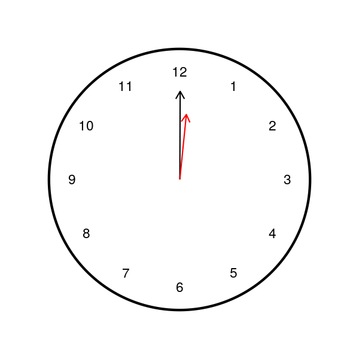
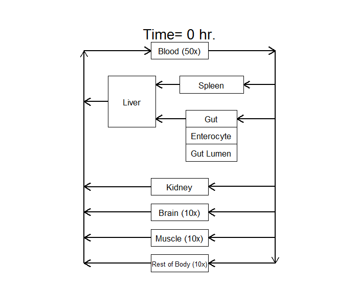

## ggdiagram

ggdiagram is a package to facilitate the creation of schematic diagrams commonly used to describe biological and engineering processes. By specifying the dimensions and attirubtes (color, line-type, size, etc) of shapes and which shapes to connect with arrows, highly customized diagrams can be created for inclusion in markdown reports, shiny apps, and to create compelling animations. 

### Installation
```{r, eval = FALSE}
library(devtools)
install_github("mhismail/ggdiagram")
```

### Features 

The package is comprised of several functions to create shapes for rectangles, squares, circles, and ellipses. Shapes can be connected with either curved or straight arrows, and the location on the shape can be specified. Some examples are given below. 

### Example 1 
```{r, message = FALSE, warning = FALSE}
library(ggdiagram)

PD_comp <- gg_ellipse(label = "Response",radiusx = 20, radiusy = 15)
point1 <- gg_point(center = c(-40, 0))
point2 <- gg_point(center = c(40, 0))
stim_input <- gg_rect(center = c(-36, 12), 
                      height = 15, 
                      width = 5, 
                      label = "I", 
                      fill = "black",
                      label_color = "white")
inhib_input <-  gg_rect(center = c(-28, 12), 
                        height = 15, 
                        width = 5, 
                        label = "III", 
                        fill = "white",
                        label_color = "black")
stim_output <- gg_rect(center = c(26, 12), 
                      height = 15, 
                      width = 5, 
                      label = "II", 
                      fill = "black",
                      label_color = "white")
inhib_output <-  gg_rect(center = c(34, 12), 
                        height = 15, 
                        width = 5, 
                        label = "IV", 
                        fill = "white",
                        label_color = "black")
kin_label <- gg_point(center = c(-32, -4), label = expression(paste("k"["in"])))
kout_label <- gg_point(center = c(30, -4), label =  expression(paste("k"["out"])))

ggdiagram() + 
  PD_comp +
  gg_arrow(c(point1, PD_comp), 
           connection1 =  "near", 
           connection2 =  "l",
           shiftxend = -1) +
  gg_arrow(c(PD_comp, point2), 
           connection1 =  "r",
           shiftx= 1) +
  stim_input +
  inhib_input +
  stim_output +
  inhib_output +
  kin_label +
  kout_label
```

### Example 2 

The package can be paired with `animation` to make animated gifs.

``` {r, eval = FALSE}


library(ggdiagram)
library(animation)

 


clockani<- function () {
  a <- gg_circle(radius = 40, size = 2)
  b <- gg_point(center = c(0, 33), label = "12", label_size = 8)
  c <- gg_point(center = c(0, 33), label = "1", rotate = -30, 
                rotateabout = c(0, 0), label_size = 8)
  d <- gg_point(center=c(0, 33), label = "2", rotate = -60, 
                rotateabout = c(0, 0), label_size = 8)
  e <- gg_point(center = c(0, 33), label = "3", rotate = -90, 
                rotateabout = c(0, 0), label_size = 8)
  f <- gg_point(center = c(0, 33), label = "4", rotate = -120, 
                rotateabout = c(0, 0), label_size = 8)
  g <- gg_point(center = c(0, 33), label = "5", rotate = -150, 
                rotateabout = c(0, 0),label_size = 8)
  h <- gg_point(center = c(0, 33), label = "6", rotate = -180, 
                rotateabout = c(0, 0), label_size = 8)
  j <- gg_point(center = c(0, 33), label = "7", rotate = -210, 
                rotateabout = c(0, 0), label_size = 8)
  k <- gg_point(center = c(0, 33), label = "8", rotate = -240, 
                rotateabout = c(0, 0), label_size = 8)
  l <- gg_point(center = c(0, 33), label = "9", rotate = -270, 
                rotateabout = c(0, 0), label_size = 8)
  m <- gg_point(center = c(0, 33), label = "10", rotate = -300, 
                rotateabout = c(0, 0), label_size = 8)
  n <- gg_point(center = c(0, 33), label = "11", rotate = -330, 
                rotateabout = c(0, 0), label_size = 8)
  point1 <- gg_square(c(0, -5), sidelength = 10, color = "blue", fill = NA)
  
  for (i in 1:(2*60)){ 
    point2 <- gg_point(c(0, 27), rotate = -i * 6/12, rotateabout = c(0, 0))
    point3 <- gg_point(c(0, 20), rotate = -i * 6, rotateabout = c(0, 0))
    hours <- gg_arrow(c(point1, point2), "up")
    minutes <- gg_arrow(c(point1, point3), "up", color = "red")
    
    print(ggdiagram() + list(c(a, b, c, d, e, f, g, h, j, k, l, m, n)) + 
            hours + 
            minutes)
  } 
}

saveGIF(clockani(), 
        replace=T,
        movie.name = 'circle.gif', 
        ani.width = 600, 
        ani.height = 600, 
        interval=.1)
```

 

### Example 3 

The motivating factor behind creating this package was to illustrate the transfer of drug between body organs by way of animation. The graphics below are two such examples. The heights of the colored rectangles were scaled based on a physiologically-based pharmacokinetic model to create the effect of drug being transferred from compartment to compartment. 


In the visual below, red is the parent drug and blue is metabolite.
 

### Example 4


```{r}
sun <- gg_circle(c(0, -10), radius = 30, fill = "gold", color = NA)
grass <- gg_rect(c(0, -30), height = 40, width = 100, color = "green2", fill = "green2")
grass1 <- gg_rect(c(0, -17.5), height = 5, width = 100, color = "green3", fill = "green3")
grass2 <- gg_rect(c(0, -27.5), height = 5, width = 100, color = "green3", fill = "green3")
grass3 <- gg_rect(c(0, -37.5), height = 5, width = 100, color = "green3", fill = "green3")
grass4 <- gg_rect(c(0, -47.5), height = 5, width = 100, color = "green3", fill = "green3")

sky <- gg_rect(c(0, 15), height = 70, width = 100, color = "blue", fill = "blue", alpha = .4)
cloud1 <- gg_ellipse(c(-30, 35), radiusx = 10, radiusy = 7, color = "white", fill = "white")
cloud2 <- gg_ellipse(c(30, 39), radiusx = 10, radiusy = 5, color = "white", fill = "white")
cloud3 <- gg_ellipse(c(-40, 15), radiusx = 10, radiusy = 5, color = "white", fill = "white")

ggdiagram() + 
  list(c(sky, sun, grass, cloud1, cloud2, cloud3, grass1, grass2, grass3, grass4))
```
